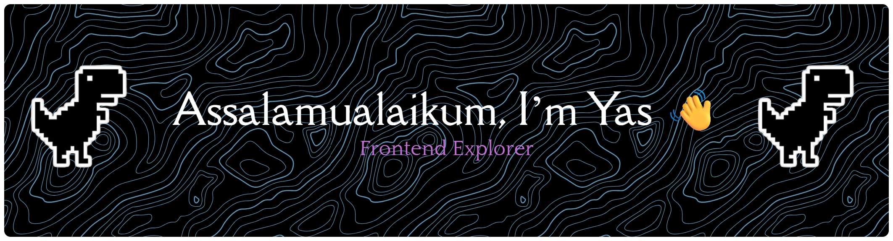

## Assalamualaikum, Habibi 👋  

  

### 👨‍💻 Tentang Saya
- 🔭 Sedang fokus mengembangkan **@57sparepart**  
- 🌱 Lagi mendalami [**Laravel Framework**](https://laravel.com)  
- 💬 Suka ngobrol tentang **coding, teknologi, dan project kreatif**  
- 📫 Bisa dihubungi lewat:  
    
    
    
    
- ⚡ Fun fact: Ngoding bisa bikin lupa waktu (dan kadang lupa makan 🍜)  

---

### 🚀 Tech Stack
  
  
  
  
  
  
  
  
  
  
  

---

### 📊 GitHub Stats
  
  
  

---

### ✨ Motto
> *“Ngoding itu bukan cuma soal sintaks, tapi seni menyelesaikan masalah.”* 🎯  

---

  
